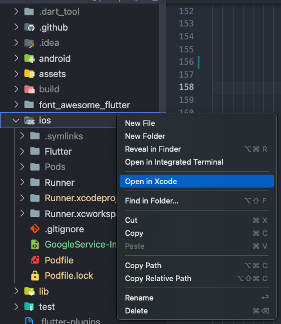

# Build & Release for iOS


Make sure you have an active Apple Developer Account. [https://developer.apple.com/](https://developer.apple.com/)


Before you can build and release your app on the App Store, you need to set up a place for it using App Store Connect. But first, you need to register a unique bundle ID for your app. This can be done by logging into your Apple Developer account and following these steps:

1. Open the **App IDs** page.
2. Click **+** to create a new **Bundle ID**.
3. Fill out the needed information: App Name, and Explicit App ID.
4. If your app needs specific services, select them and click **Continue**.
5. Review the details and click **Register** to finish.

Now that we have a unique bundle ID, it’s time to set up a place for your app on the App Store Connect. Log in to the App Store Connect.

1. Select **My Apps**.
2. Click **+** then select **New App**.
3. Fill in your app details and make sure **iOS** is selected, then click **Create**.
4. From the sidebar, select **App Information**.
5. In the General Information section, select the **Bundle ID** that you registered above.

### Now we move to the app code side

1.  Open the project that is inside your app’s iOS folder or right click on ios folder and click Open in Xcode.

    
2. From the Xcode project navigator, select the **Runner** project.
3. Then, select the **Runner target** in the main view sidebar.
4. Go to the **General** tab.
5. In the **Identity** section, fill out the information and make sure the **Bundle Identifier** is the one registered on App Store Connect.
6. In the **Signing** section, make sure **Automatically manage signing** is checked and select your **team**.
7. Fill out the rest of the information as needed.
8. Next, you’ll update your app’s icon. This can be done by selecting **Assets.xcassets** in the Runner folder from Xcode’s project navigator

### Now let's build and upload the app to app store

1. From the command line, run `flutter build ios`
2. Then go back to Xcode and reopen **Runner.xcworkspace**
3. Select **Product** -> **Scheme** -> **Runner**.
4. Select **Product** -> **Destination** -> **Generic iOS Device**.
5. Select **Product** -> **Archive** to produce a build archive.
6. From the Xcode **Organizer** window, select your iOS app from the sidebar, then select the build archive you just produced.
7. Click the **Validate…** button to build.
8. Once the archive is successfully validated, click **Upload to App Store.**

Back on App Store Connect, check the status of your build from the **Activities** tab. Once it’s ready to release:

1. Go to **Pricing and Availability** and fill out the required information.
2. From the sidebar, select the **status**.
3. Select **Prepare for Submission** and complete all required fields.
4. Click **Submit for Review**.
