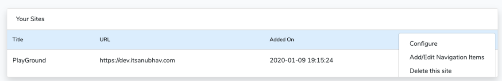
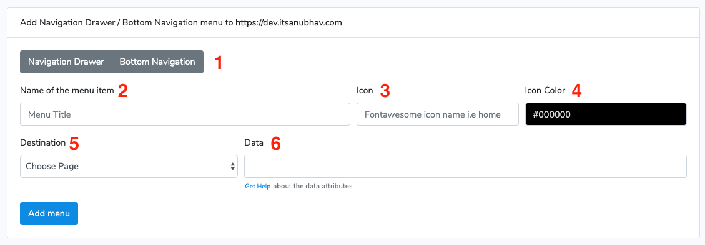

# Add Navigation Drawer & Bottom Navigation Items

After adding you site, you can add bottom navigation menu and menu drawer item to your app from the dashboard.

1.Click on the more button.

2\. Click on the **Add/Edit Navigation Items**

3\. You will see a form on the next page asking you the details.

1. &#x20;**Navigation Drawer / Bottom Navigation** : Choose **Navigation Drawer** if you want to add the item to navigation drawer (max 30 items are allowed ) or choose **Bottom Navigation** if you want to add the item to the bottom navigation bar (max 5 items are allowed).&#x20;
2. **Name of the menu item** : Enter the name of the menu item you want.
3. **Icon** : Enter the name of the FontAwesome Icon. Make sure you just put the name of the icon. For example: enter **home** and not **fa-home**.
4. **Icon Color** : Color of the icon. If you are adding a bottom navigation item then the Icon Color will not be used. The icon color will be used from the **bottom navigation configuration** in the App Config page.&#x20;
5. **Destination** : Choose what the app should open when clicked on that menu item. Don't add **Dynamic HomePage** to the navigation drawer item.
6. **Data** : Add the additional data. Click on **Get Help** to see what to fill in that field.
