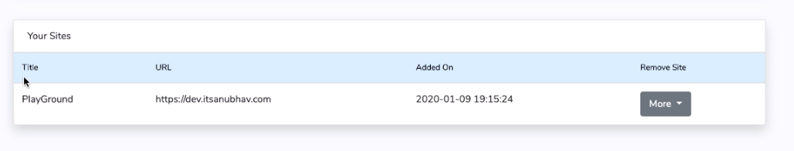

# Add your site


You can add maximum 2 sites in your dashboard.


1\. Click on **Add More** button. &#x20;

2\. Enter your site **Title** and **Site URL** and click **Save** _(make sure you enter the exact domain as it  shows in your WordPress Dashboard > Settings > Site Address (URL) )_&#x20;

**You will see your site like this.**

