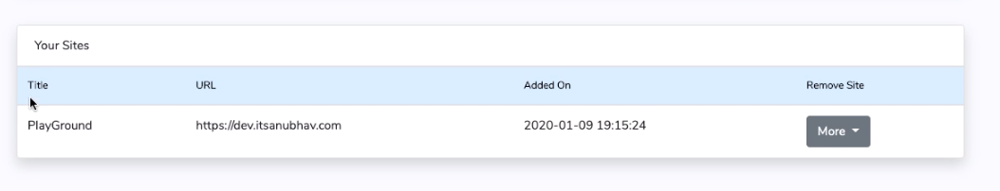
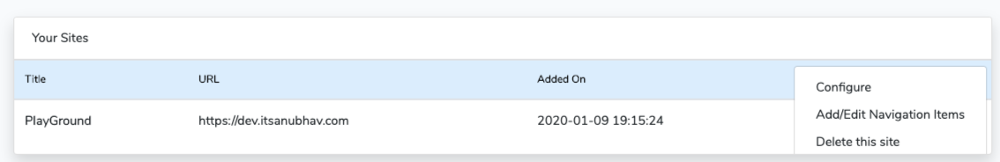

# Configure Basic Settings

After adding your bottom navigation menu and menu drawer item to your app, you can also adjust some basic customisation of the app

1.Click on the more button.

2\. Click on **Configure**

3\. You will see a screen with multiple forms.

1. **Basic App Setting** : You can configure App Title, App Intro, SignIn, Default Image URL, About Page URL and Privacy Policy Page URL
2. **Post Page Settings** :  You can enable/disable banner ads, Interstitial ads,  Post speak feature, Long click to copy and can config Interstitial ads frequency and external links behaviour.
3. **Posts-List Page Settings** : You can enable/disable banner ads, native ads and configure native ads frequency in the list and the layout of the item.
4. **Bottom Navigation Bar** : Change selected item colours on selected item colour, background colour, labels visibility and the bottom nav visibility
5. **Navigation Drawer** : Enable or disable the navigation drawer header, change the navigation drawer header background colour and hide the navigation drawer.
