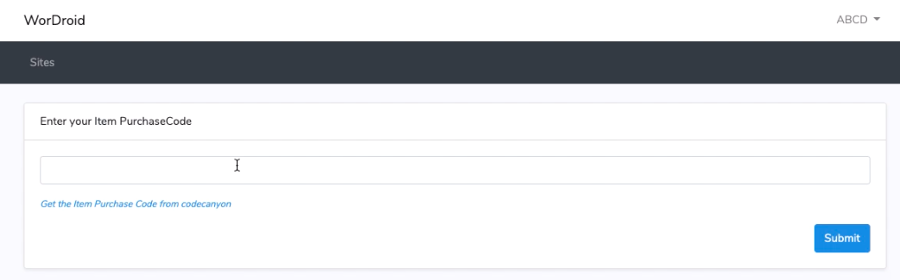

# Register your app


Skip **Step 1:** **Register your app** step if you are using app version 4.2 or higher. Move to **Step 2 : WordPress Plugin**


1. **Go to** [**http://dashboard.itsanubhav.com/**](http://dashboard.itsanubhav.com/)
2. **Register / Login to go to the dashboard.** _( Make sure you use your original email. Updates/Support notification will be sent to the same email. )_
3. Click on verify purchase.

&#x20;   4\. Enter your Item Purchase code in the input box and click on **Submit**. &#x20;

&#x20;   5\. Click on **Add More** button. &#x20;

&#x20;   6\. Enter your site **Title** and **Site URL** and click **Save** _(make sure you enter the exact domain as it  shows in your WordPress Dashboard > Settings > Site Address (URL) )_&#x20;

&#x20;   7\.&#x20;

